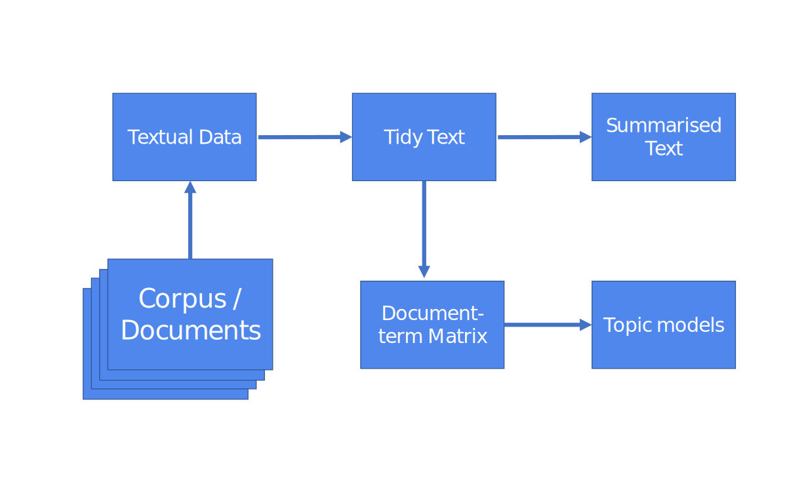

```{r setup, include=FALSE}

knitr::opts_chunk$set(echo = TRUE, 
                      warning = FALSE, 
                      message = F, error = F)

library(tidyverse)
library(tidytext)
library(stringr)
library(kableExtra)
library(knitr)
library(ggplot2)
library(stm)
library(tsne)
library(wordcloud)

theme_set(theme_bw())

```

# Text mining and text analysis

## Let's take a form!

* https://bit.ly/3bTmTDU

## Training resources

* https://fraba.github.io/2022-ANZCA-workshop-The-art-of-text-analysis/ 

* (for short -> https://bit.ly/3yIvmmq)

## Also, open these slides in your browser

* https://fraba.github.io/2022-ANZCA-workshop-The-art-of-text-analysis/slides/training-slides.html

* (for short -> https://bit.ly/3yOAGVv)

# Tableau

## Tableau at a glance

{width=80%}

* Data analytics and interactive data visualisation software, it allows you to publish interactive dashboard online (alternative to Microsoft Power BI)

* No code/low-code approach 

* Not free, not open-source (owned by Saleseforce), but generous free licencing for students

* Facilite data import from a variety of sources (including JSON)

## Tableau: At a glance

{width=90%}

## Tableau: Connecting to a data source 

The first step when you open a new project in Tableau is to connect to a data source. 

* You can connect to a number of data sources. 
* Once you have connected a datasource, you can link them using unique keys. 

## Tableau: Map measures and dimensions 

Let's open Tableau ...

## Tableau: Connect to a file

1. Click on "Connect to Data".

2. Then, "To a File" -> "Text file".

3. Locate the file `tableau_gender.csv` and open it.

This two step will connect your workbook to a .csv text file. But you also connect to an Excel file, a PDF, a spatial file or a JSON file (data import is one of the best feature of Tableau!).

* To connect to an additional file (`tableau_height-weight.csv`), next to "Connections" click on "Add" (and then redo steps 1.,  2. and 3.)

* (You might need to drag the second file to the connection panel)

## Tableau: Join two tables

Sometimes, your data is scattered in more than just one table. In this example, for each observation (i.e. person) we have `Gender` in one table and the `Weight` and `Height` in a different table. To join the information from the two tables, we need a column with a unique ID. In this example, that column is labelled, not surprisingly, `id`.

After you connect to your files, Tableau will automagically join two or more table if it identifies a common unique ID column. You can check on which columns the tables have been joined (or change the join columns) by clicking on the symbol connecting the two tables.

## Tableau: Visualise your data

### Visualise the count

If you want to count how many females and males you have in your data,

* Go to your worksheet (probably called "Sheet 1").

 You should now see you data on the left with a list of your "Dimensions" and "Measures".
 
##

* Drag-and-drop `Gender` in the "Columns" bar.

* Drag-and-drop `Gender` in the "Rows" bar.

* Click on the little triangle on the right of "Gender" in the "Rows" bar.

* Select "Measure" -> "Count".

Not that exciting, we have 5k records for each `Gender`.

## Tableau: Visualise your data

### Visualise the average

* Remove the "CNT(Gender)" from the "Rows" bar by drag-and-dropping it somewhere else.

* Drag-and-drop Height (or Weight) from below "Measures" in the "Rows" bar.

Automatically, Tableau will sum all the values. So you can see now what is the total height (or weight) calculated by summing all the heights (and weights) in the data. This is not very interesting. Let’s instead calculate the average for male and females.

* Click on the little triangle on the right of "Height" (or "Weight") in the "Rows" bar.
Select "Measure" -> "Average".

##

* Visualise the distribution of your measures

It’s always important to have a sense of the distribution of a measure before you start analysing it.

Make sure your "Columns" and "Rows" bars are empty: drag-and-drop any content away.

* Click on Height (or Weight) from below "Measures", on the left-hand side of the window.

##

* Click on the histogram view on the right-hand side of the window.

* Drag-and-drop `Gender` in the "Rows" bar.

Do you understand what you see?

## Tableau: Export your view

To export the visualisation you have created you can

Click on "File" in the menu bar, then "Export as PowerPoint…" -> "Export".

## JSON files

JSON files are not tabular, so connecting and importing the data is slightly more challenging. You need to select the "schema levels" we want to import.

```
{
  "firstName": "John",
  "lastName": "Smith",
  "isAlive": true,
  "age": 27,
  "address": {
    "streetAddress": "21 2nd Street",
    "city": "New York",
    "state": "NY",
    "postalCode": "10021-3100"
  },
  "phoneNumbers": [
    {
      "type": "home",
      "number": "212 555-1234"
    },
    {
      "type": "office",
      "number": "646 555-4567"
    }
  ],
  "children": [
      "Catherine",
      "Thomas",
      "Trevor"
  ],
  "spouse": null
}
```

## JSON files

You might consider *OpenRefine* to open and convert JSON files. 

## Tableau: Import JSON file

Tableau is good in importing JSON files

Importantly, Tableau will bind multiple rows about the same tweet together if we import multiple items. So watch out for double counting the same tweet!

* Let's open the JSON file `eurovision.json`. 

#  Tableau: Let's count the number of occurrences of a word!

## Tableau: Functions

```
FUNCTION([COLUMN NAME], attribute1, attribute2)
```

## Tableau: String functions

Tableau offers a number of string functions (https://help.tableau.com/current/pro/desktop/en-us/functions_functions_string.htm). These functions can be used in a "calculated field". Today we'll use two functions. 

* `CONTAINS`

* `LOWER`

```
CONTAINS(LOWER([COLUMN NAME]), "someword") = true
```


## Tableau: Export your data

In "Data source"...

* "Data" 

* "Export", then "Export Data to CSV"

# Now let's move to R

# A one-slide introduction to 

```{r, out.width='15%', fig.align='center', echo = FALSE}
knitr::include_graphics('img/r_logo.svg')
```

##

R is an *object-oriented* programming language. This means that everything in a R is an **object**. 

Most of the objects can be broadly categorised either as
* **Values** (or variables) `my_data <- 6`, or as 
* **Functions** `my_function <- function(data){data + 1}`.

Each values is an object of a specific *class*. 

```{r}
my_data <- 6
class(my_data)
```

**Functions** accept objects of some *class* and return objects of some (but not necessary the same) *class*. 

# Let's open RStudio...

## Open these slides in your browser

* https://fraba.github.io/2022-ANZCA-workshop-The-art-of-text-analysis/slides/training-slides.html

* (for short -> https://bit.ly/3yOAGVv)

## Installing packages

Do these packages load?

```{r}

library(tidyverse)
library(tidytext)
library(stringr)
library(kableExtra)
library(knitr)
library(ggplot2)
library(stm)
library(tsne)
library(wordcloud)

```


# A one-slide introduction to

<div align="center" ><h2 style="font-size:200%;">tidy data in </h2></div>

##

Accordingly (see [tidyr.tidyverse.org](https://tidyr.tidyverse.org/)),

```{r, echo=FALSE}
not_tidy_data <- 
  tibble(country = c('A', 'B', 'C'),
         `1999` = c('0.7K', '37K', '212K'),
         `2000` = c('2K', '80K', '213K'))
```


```{r, echo=F}
kable(gather(not_tidy_data, "1999", "2000", key="year", value="cases"), caption = 'Tidy data') %>%
  kable_styling(bootstrap_options = "striped", full_width = F, position = "float_right")
kable(not_tidy_data, caption = 'Not tidy data', format = 'html') %>%
  kable_styling(bootstrap_options = "striped", full_width = F, position = "float_right")
```


> Tidy data is data where:
> 
> 1. Each variable is in a column.
> 2. Each observation is a row.
> 3. Each value is a cell.

## magrittr: R code with pipes (%>%)

```{r, out.width='15%', fig.align='center', echo = FALSE}
knitr::include_graphics('img/magritte-pipe.svg')
# Artwork by dan lowenstein, IL
```

##

```{r, echo=F}
kable(iris[1:3,])
```

```{r}
iris %>%
  group_by(Species) %>%
  summarize(Average.Petal.Length = mean(Petal.Length))
```

## Text analysis in R: A Workflow

1. Import your data
2. Tidy your data
3. Model your data
4. Present your results

{width=80%}

## Document-term matrix

```{r}
data <- 
  tibble(text = c(  
    "pollution water environment jobs","healthcare doctors hospitals pollution",
    "smog environment water doctors","unemployment jobs wages immigration", 
    "hospitals drugs doctors visa","healthcare drugs doctors wages",
    "jobs wages unemployment healthcare","hospitals drugs doctors citizenship",
    "environment smog water economy", "foreigners immigration citizenship doctors",
    "immigration visa foreigners jobs", "economy wages jobs healthcare",
    "citizenship immigration foreigners drugs"),
    author = c("Sam", "Rosy", "Tom", "Alice", "Bob", "Carol", "Diana", 
               "Zach", "Yolie","Xavi", "Ahmad", "Ali", "Nemat")) 
dfm <- 
  data %>%
  unnest_tokens(word, text) %>%
  count(author, word, sort = TRUE) %>%
  cast_dfm(author, word, n)
```

## Document-term matrix

```{r, echo = FALSE}
kable(dfm[,1:8])
```

# Topic modelling 

## Let's load the data

We need to load `g_books.RData` in the `rdata` folder (within `data`). 

```{r load, include=FALSE}

load("../data/rdata/g_books.RData")

```

## We divide each book by chapter

```{r}

reg <- 
  regex("^chapter ", ignore_case = TRUE)

by_chapter <- g_books %>%
  group_by(title) %>%
  mutate(chapter = cumsum(str_detect(text, reg))) %>%
  filter(chapter > 0) %>%
  ungroup() %>%
  group_by(gutenberg_id, title, chapter) %>%
  summarize(text = paste(text, collapse = " ")) %>%
  unite(title_chapter, title, chapter, sep = " # ")

#  View(by_chapter)

```

## We create a document-term matrix ...

```{r}

tidy_books <- 
  by_chapter %>%
  group_by(title_chapter) %>%
  unnest_tokens(word, text) %>%
  ungroup() %>%
  mutate(word = str_extract(word, "[a-zA-Z]+")) %>%
  anti_join(stop_words, by = 'word')

nrow(tidy_books)

books_dfm <- tidy_books %>%
  count(title_chapter, word, sort = TRUE) %>%
  cast_dfm(title_chapter, word, n)

# View(as.matrix(books_dfm))

```

## And finally we model... 

```{r cache = T}

# This will take a few seconds
model <- 
  stm(books_dfm, K = 4, 
      verbose = FALSE, init.type = "Spectral")

```

## Show most significant words by topic

```{r}

labelTopics(model, 1:4)

```

## Show proportion by topic

```{r}

plot(model, type = "summary")

```

## Cloud for a topic

```{r out.width="80%"}

cloud(model, topic = 1)

```

## Word - Topic

```{r}

tidy_topics_word_topic <-
  tidy(model)

kable(head(tidy_topics_word_topic))

# View(tidy_topics_word_topic)
```

## Document - Topic

```{r}

tidy_topics_doc_topic <- 
  tidy(model, matrix = "gamma",                    
       document_names = rownames(books_dfm))

tidy_topics_doc_topic <-
  tidy_topics_doc_topic %>%
  separate(document, c("title", "chapter"), sep = " # ", convert = TRUE)

kable(head(tidy_topics_doc_topic))


```


## Visualisation 1


```{r eval = F}

ggplot(tidy_topics_doc_topic,
       aes(y = gamma, x=factor(topic))) +
  geom_boxplot() + 
  facet_wrap(~title)

```

##

```{r echo = F}

ggplot(tidy_topics_doc_topic,
       aes(y = gamma, x=factor(topic))) +
  geom_boxplot() + 
  facet_wrap(~title)

```

## Visualisation 2

```{r eval = F}

tidy_topics_doc_topic$document <- 
  paste0(tidy_topics_doc_topic$title, " # ", tidy_topics_doc_topic$chapter)
spread_topics_doc_topic <-
  tidy_topics_doc_topic %>%
  spread(topic, gamma)

res <- tsne(spread_topics_doc_topic[,4:7], k=2)
spread_topics_doc_topic$x <- res[,1]
spread_topics_doc_topic$y <- res[,2]

ggplot(spread_topics_doc_topic, aes(x=x,y=y,colour=title)) +
  geom_point()

```

##

```{r echo = F}

tidy_topics_doc_topic$document <- 
  paste0(tidy_topics_doc_topic$title, " # ", tidy_topics_doc_topic$chapter)
spread_topics_doc_topic <-
  tidy_topics_doc_topic %>%
  spread(topic, gamma)

res <- tsne(spread_topics_doc_topic[,4:7], k=2)
spread_topics_doc_topic$x <- res[,1]
spread_topics_doc_topic$y <- res[,2]

ggplot(spread_topics_doc_topic, aes(x=x,y=y,colour=title)) +
  geom_point()

```
